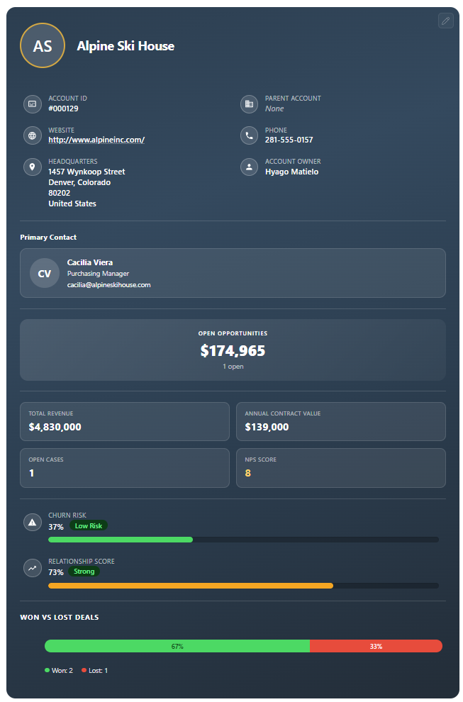
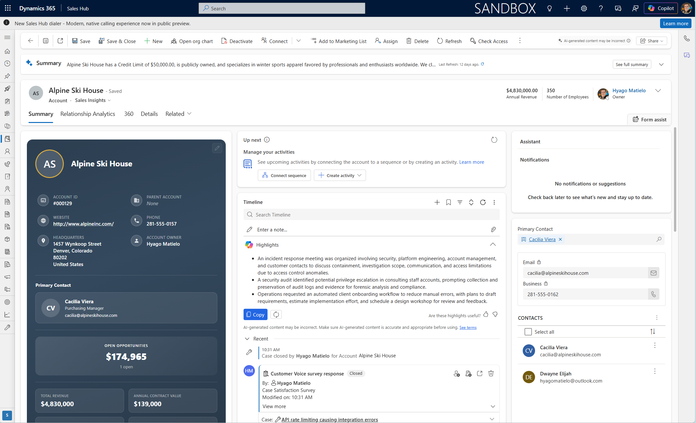

# Account 360 Profile Card for Dynamics 365

A compact, visually rich account profile card designed to be embedded directly on the Account form in Microsoft Dynamics 365 Sales. Gives users an at-a-glance view of account health, scores, and key relationships.

## Screenshots

| Profile Card | Embedded in Dynamics 365 |
|:------------:|:------------------------:|
|  |  |

## What It Does

When placed on an Account record, this card displays:

- **Account photo & name** — with initials fallback and image upload support.
- **Industry & address** — core account details shown inline.
- **Inline editing** — click any editable field to update it. Changes save back to Dynamics 365 instantly.
- **Scores section** — NPS Score, CSAT Score, Annual Contract Value, Churn Risk, and Relationship Score with progress bars.
- **Open opportunities** — count and total pipeline value.
- **Won/Lost deals** — bar chart with legend.
- **Primary contact** — avatar, name, role, and email.
- **Color customization** — built-in color picker to personalize the card's background.

## How to Use It

1. **Upload as a Web Resource** — in your Dynamics 365 environment, create a new HTML web resource using the `account360.html` file.
2. **Add to the Account Form** — open the Account main form in the form editor, add a **Web Resource** control, and point it to the web resource you created.
3. **Publish** — save and publish the form.

No additional servers or installations required. Everything runs inside Dynamics 365 using the built-in Web API.

## Requirements

- Microsoft Dynamics 365 Sales (online)
- Custom fields on the Account entity: `new_npsscore`, `new_annualcontractvalue`, `new_churnrisk`, `new_relationshipscore`

## License

[MIT](LICENSE.txt)
