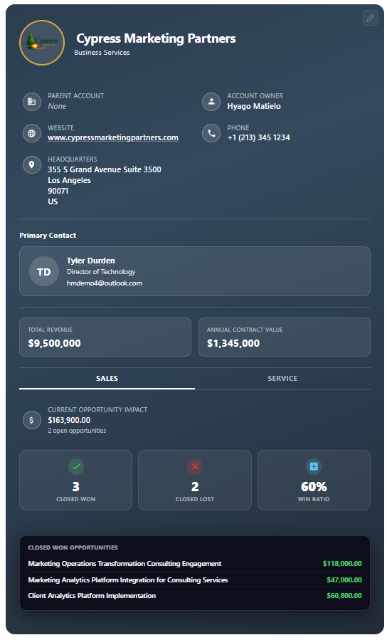
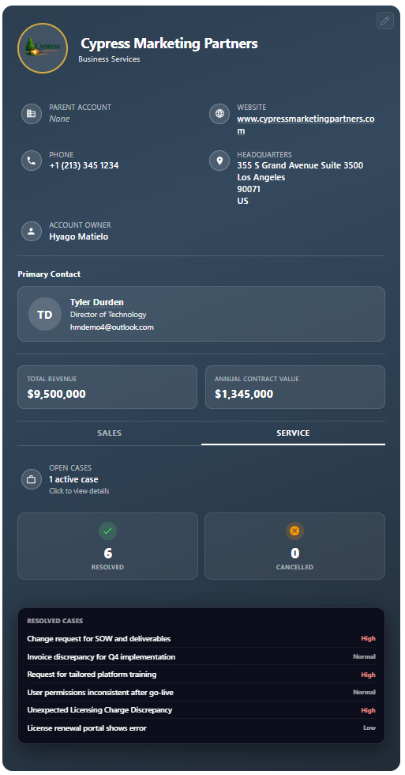

# Account 360 Profile Card for Dynamics 365

A compact account profile card for Microsoft Dynamics 365 Sales that sits directly on the Account form and surfaces account context, pipeline activity, service history, and the linked primary contact in one place.

## Screenshots

| Sales Tab | Service Tab |
|:---------:|:-----------:|
|  |  |

| Embedded in Dynamics 365 |
|:------------------------:|
|  |

## What It Does

When placed on an Account record, this card displays:

- **Account photo & name** — with initials fallback and image upload support.
- **Core account details** — industry, parent account, website, phone, headquarters, and account owner in the aligned header layout.
- **Primary contact** — avatar, name, title, and email. Clickable name opens the Contact record.
- **Total Revenue & Annual Contract Value** — editable stat cards.
- **Sales tab** — current opportunity impact (pipeline value + count), closed won / closed lost / win ratio metrics, with clickable popups that list individual opportunities.
- **Service tab** — open cases count, resolved / cancelled metrics, with clickable popups that list individual cases by priority.
- **Inline editing** — click any editable field to update it. Changes save back to Dynamics 365 instantly.
- **Color customization** — built-in color picker to personalize the card's background and photo border.

The Sales and Service tabs roll up data from the account itself **and** from contacts related to that account.

## How to Use It

1. **Upload as a Web Resource** — in your Dynamics 365 environment, create a new HTML web resource using the `account360.html` file.
2. **Add to the Account Form** — open the Account main form in the form editor, add a **Web Resource** control, and point it to the web resource you created.
3. **Publish** — save and publish the form.

No additional servers or installations required. Everything runs inside Dynamics 365 using the built-in Web API.

## Requirements

- Microsoft Dynamics 365 Sales (online)
- Custom field on the Account entity: `new_annualcontractvalue`
- Sales and Service metrics depend on related opportunities and cases existing in the environment

## License

[MIT](LICENSE.txt)
